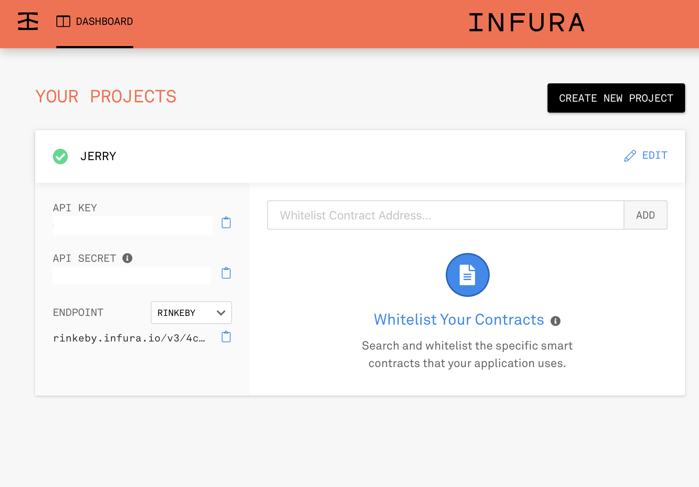

# Multi-signature-wallet
Demo of multi-signature wallet.
Note with the open source from https://github.com/gnosis/MultiSigWallet
Let the developers use this open source repo more restful.

# Setting
```
cd dapp/
npm install -g grunt-cli
npm install
grunt
```
Then you can open http://0.0.0.0:8282/ in browser.

After that, you need to go to infura to get the rinkby end point url.



Then, copy the env.js.example to env.js and add the web3Url and privateKey information in testnet.

Now, you can deploy your first multi-signature wallet!

```
truffle deploy address1, address2, address3 comfirmationNumber --network testnet
```

After deploying the contract, you can add the wallet address to the website.


